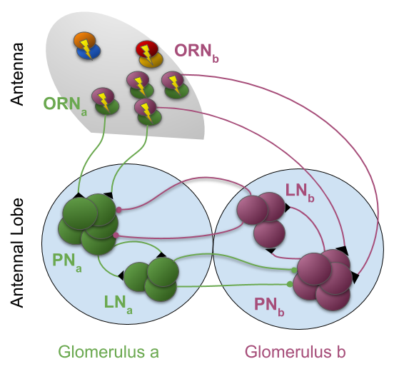
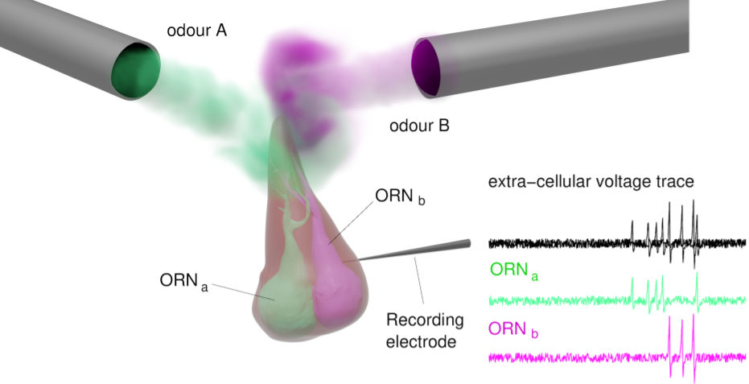

# flynose

The goal of this project is to develop a model of the early olfactory system of *Drosophila*. 

The model consists of a subset of the early olfactory system of insects from ORNs to the AL using only two groups of ORNs (ORN_a and ORN_b) and their respective PNs and LNs. Each ORN type, *a* and *b*, is though to be tuned to a specific set of odorants (e.g. individual pheromone component) and converges onto its corresponding PNs. 

  

Each pair of ORNs is cohoused in a same sensillum and therefore they interact via Non-synaptic mechanism (see figure below). PNs impinge into their respective LNs, but receive inhibitory input from LNs of the other type.

## Structure

Python is the present programming language. The core script is **flynose.py**. It consists of three separated parts:

1. stimulus generation: four kinds of stimuli can be generated (each have different id): triangular (*'ts'*), step (*'ss'*), real plumes (*'pl'*) and loaded from an external file (undefined)
2. ORNs simulation
3. AL simulation

To run, **flynose.py** uses other scripts:

- **sdf_krofczik.py**: 
- **stats_for_plumes.py** 
- **corr_plumes.py** 

### Syntax

>  [t, u_d, orn_sp_mat, pn_sp_mat, ln_sp_mat] = flynose(params2an, flig_opts)

### Parameters

*params2an* is a list containing the main parameters that are used for the most common simulations: the strength of the NSI, *nsi_str* and the strength of the AL lateral inhibition, *alpha_ln*. The third element is another list with the parameters for the stimulus: *stim_params*.

*fig_opts* is a list containing several flags to decide from outside **flynose.py** whether for exanple if we want the figure of the ORNs dynamics, *orn_fig*, or to save the figure, *fig_save*, or to simulate the AL, *al_dyn*.

### Return

> [t, u_d, orn_sp_mat, pn_sp_mat, ln_sp_mat] : list of five ndarray

The output is a single variable that consists of 5 vectors:

* t: 1d np array, the time series of the time used for the simulation (ms)
* u_od: 2d np array of the odorant concentration input to the ORNs
* orn_sp_mat: 2d np array of the spikes trains of the ORNs. The first column is spike time and the second column is the ORN id
* pn_sp_mat:2d np array of the spikes trains of the PNs. The first column is spike time and the second column is the PN id
* ln_sp_mat: 2d np array of the spikes trains of the LNs. The first column is spike time and the second column is the LN id

### Stimuli

There are four different  types of stimuli: 

1. single step - constant concentration to both ORNs, with different onsets and offsets, different peaks
2. triangle - linear increase and decrease, with different onsets and offsets, different peaks
3. real plumes - two correlated realistic plumes, with a given distribution of whiffs, clean air and concentration. To simulate the correlated naturalistic plumes use **corr_plumes.py**.
4. external - input given from an external file. For example, we used the data observed by Kim, Lazar and colleagues and saved in the folder *lazar_data_hr*.

### Analysis and visualization

There are several scripts to lauch the core **flynose.py**. For example, to explore the parameters using different kind of stimuli: **flynose_examples.py**, **batch_ratio.py**, **batch_delays.py**, **batch_real_plumes.py**.

To analyse the output of the batch files, use **analysis_ratio_delays.py** and **analysis_real_plumes.py**.

**plot_flynose.py** produces plots for:

1. the simulations with external stimuli (*Lazar et al. 2019*). It loads data from the folder *NSI_analysis/lazar_sim* that are produced with **flynose_example.py**.
2. the simulations showing the Intensity invariance of the ORNs response for several concentration values (*Martelli et al. 2013*). It loads data from the folder *Olsen2010_Martelli2013/data* that were produced with  **flynose_example.py**.
3. the simulations showing the sigmoidal curve of the relation between ORNs responses and PNs responses (Olsen and Wilson 2010). It loads data from the folder *Olsen2010_Martelli2013/data* that were produced with  **flynose_example.py**.

**plot_plumes_stats.py** helps visualize the temporal and statistical properties of the naturalistic plumes reproducing the data furnished in literature (i.e. *Yee et al. 1995, Murlis et al. 1991*).

**plot_corr_plumes.py** helps visualize the temporal and statistical properties of the simulated naturalistic plumes. It runs launching multiple times the function **corr_plumes.py**.

**plot_diag_shades.py** plots the network response  for multiple runs for three different models (*NSI-model, LN-model and ctrl-model*) to three kind of stimuli:

* Real plumes (fig_is='pl') runs **flynose.py** with a real plume 
* Impulse response (fig_is='pl') runs **flynose.py** with two triangular syncrhonous stimuli (50ms durations)
* Delayed impulse response (fig_is='pl') runs **flynose.py** with two triangular syncrhonous stimuli (50ms durations, 100ms delay)

**flynose_example.py** is a collection of different examples of how to use flynose.py (6 of them were used in the publication *Pannunzi et al.*: 

* ORN_response
  * run **flynose.py** a single time the 3 networks (*indep*, *LN-inhib*, *NSI*) with step stimulus for 500ms and make the figure for ORN_response
* Olsen-Wilson 2010
  * Run **flynose.py** multiple times with a step stimulation (constant stimuli lasting 500ms) for the three different networks (*indep*,*LN-inhib*, *NSI*)
* Lazar and Kim data reproduction
  * Run **flynose.py** with an external input. The input are extracted from the fig.4 of Lazar et al. (2019).
* Real plumes, example figure
  * Run **flynose.py** for a single run with a real plume 
* ImpulseResponse
  * Run **flynose** with two triangular syncrhonous stimuli (50ms durations), for the three different networks 
* DelayResponse
  * Run **flynose** with two triangular syncrhonous stimuli (50ms durations, 100ms delay), for the three different networks 
* (Trials and errors)

#### ... in the same folder

**NSI_analysis.zip** contains figures and data of the results of Pannunzi and Nowotny (*writing*).

**Olsen2010_Martelli2013.zip** contains figures and data to show the model reproduction of the results from *Olsen et al. 2010* and *Martelli et al. 2013*.

**plot_hyp1.py** and **NSI_corr_uncorr.py** to plot the first and the second hypotheses of the possible role of the NSI in the insects' olfaction illustrated in Pannunzi and Nowotny (*writing*).

#### ... for the paper

see the resuing table to generate the figures 'figures.md'

### Related publication: 

[Olsen, S. R., Bhandawat, V., & Wilson, R. I. (2010). Divisive Normalization in Olfactory Population Codes. In *Neuron* (Vol. 66, Issue 2, pp. 287–299).](http://dx.doi.org/10.1016/j.neuron.2010.04.009)

[Pannunzi, M., & Nowotny, T. (2019). Odor Stimuli: Not Just Chemical Identity. *Frontiers in Physiology*, *10*, 1428](https://www.frontiersin.org/articles/10.3389/fphys.2019.01428/full)

[Yee, E., Wilson, D. J., & Zelt, B. W. (1993). Probability distributions of concentration fluctuations of a weakly diffusive passive plume in a turbulent boundary layer. In Boundary-Layer Meteorology (Vol. 64, Issue 4, pp. 321–354)](https://link.springer.com/article/10.1007/BF00708930)
[Su, C.-Y., Menuz, K., Reisert, J., & Carlson, J. R. (2012). Non-synaptic inhibition between grouped neurons in an olfactory circuit. Nature](https://pubmed.ncbi.nlm.nih.gov/23172146/)